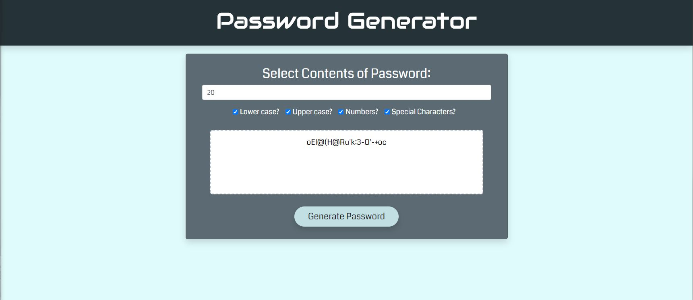

# Password Generator 
   

  Here is an application to generate a password to the users’ specifications. It uses HTML, CSS, and JavaScript to create a dynamic webpage. This password generator will take in input from the user and determine the strings of characters to use in the generation of a password. Each password if randomly generated.

  

  Here is the link to the functioning site: https://wilsoncollin7.github.io/Password-Generator/

  ## Table of Contents

  - [Installation](#installation)
  - [Usage](#usage)
  - [License](#license)
  - [Contributing](#contributing)
  - [Tests](#tests)
  - [Questions](#questions)

  ## Installation

  You can open the webpage using the live link or clone the repo.

  ## Usage

  This uses checkboxes to determine what the user needs in a password. Then the user hits the generate button and JavaScript figures out which string is needed to generate a password based off of a random number for loop. The password is then displayed in the text area.

  ## License

  This application is made with the [MIT License](https://opensource.org/licenses/MIT)

  ## Contributing

  If you have something you want to contribute, please contact me.

  ## Tests

  If you find any bugs or errors, please contact me.

  ## Questions

  For any questions you might have, you can email me at wilsoncollin7@gmail.com. You can also check out my [GitHub Profile](https://github.com/wilsoncollin7).
