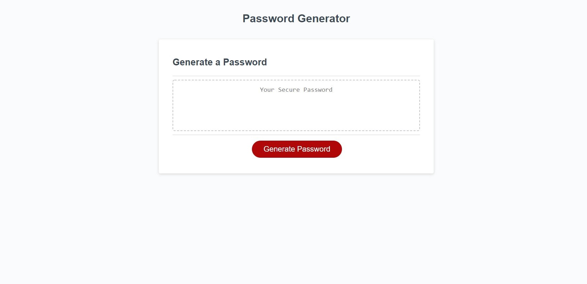

# Password-Generator

Here is an application to generate a password to the users specifications. It uses HTML, CSS, and Javascript to create a dynamic webpage. This is a homework assignment for the UNC Bootcamp, it tests our skills with Javascript. This password generator will take in input from the user and determine the strings of characters to use in the generation of a password. Each password if randomly generated.

Here is the link to the functioning site: https://wilsoncollin7.github.io/Password-Generator/

